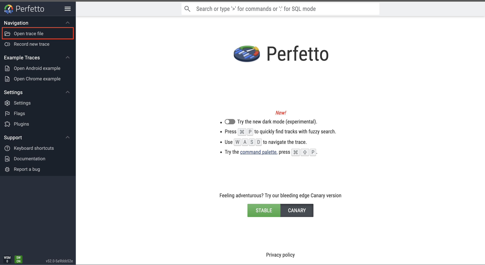

# **Elana**: A Simple Energy & Latency Analyzer for LLMs 


A lightweight, academic-friendly profiler for analyzing **model size**, **prefilling latency (TTFT)**, **generation latency (TPOT)**, and **end-to-end latency (TTLT)** of Large Language Models on multi-GPU and edge GPU plaforms. 
ELANA provides a simple command-line interface and optional **energy consumption logging**, making it ideal for research on efficient LLM.

---

## ✨ Features

- 🔍 **Profile model memory footprint**, supporting Transformers, Mamba, and hybrid models
- ⚡ **TTFT (Time-To-First-Token)** measurement for prefilling stage
- 🎯 **TPOT (Time-Per-Output-Token)** measurement for autoregressive decoding
- 🧩 **TTLT (Time-To-Last-Token)** profiling for full end-to-end inference
- 🔌 **GPU energy logging support** for both multi-GPUs on servers and edge GPUs on jetson series
- 🔥 Optional **Torch Profiler** integration for kernel-level insights, similar to Nvidia Nsight Compute
- 🧱 Compatible with any HuggingFace `AutoModelForCausalLM` model and self-developed model classes

---

## 🚀 Create Environment

You can use either **conda** or **virtualenv**.

## Clone repository
```bash
git clone https://github.com/hychiang-git/Elana.git
cd Elana
```

### Using conda
```bash
conda create -n elana-env python==3.12
conda activate elana-env
```

### Using virtualenv
```bash
python3 -m venv elana-env
source elana-env/bin/activate
pip install --upgrade pip
```

---

## 📦 Install Elana and its Dependencies

```bash
pip install .
```

## ⚡ Quick Start

### TTFT (prefilling latency)
```bash
elana meta-llama/Llama-3.2-3B-Instruct --ttft --energy
```

### TPOT (decoding latency)
```bash
elana meta-llama/Llama-3.2-3B-Instruct --tpot --energy --cache_graph
```

### TTLT (end-to-end latency)
```bash
elana meta-llama/Llama-3.2-3B-Instruct --ttlt --energy --cache_graph
```
### Profile model size
```bash
elana meta-llama/Llama-3.2-3B-Instruct --size
```

## 📚 More Usage Examples
```bash
elana --help
```

## Visualize trace file with Perfetto

We use torch profile to generate a json trace file and visualize it with [Perfetto](https://ui.perfetto.dev/). For example, run
```bash
# use --torch_profile
elana meta-llama/Llama-3.2-3B-Instruct --tpot --energy --cache_graph --torch_profile
```

By adding `--torch_profile`, it will create a folder for the trace files at
```bash
torch_profile/
    {model_name}/
        kernel_metrics.{profile_task}.{timestamp}.csv # all kernels profiling results
        kernel_type_metrics.{profile_task}.{timestamp}.csv # summarize the grouped kernels by user's tags
        {profile_task}.{machine name}.{timestamp}.pt.trace.json # the trace file can be visualized on Perfetto
```
To open a trace file on perfetto, you have to download it first, and open it on the website


Here is a example of visualizing the details of a kernel


## ⚠️ Limitations
- The tool has only been tested with multi-GPU on one node, multi-node environment has not been tested yet.
- CUDA graph capture may not work for models with cpu operations, dynamic shapes or unconventional cache layouts.  
- Energy logging is relied on GPU APIs from nvidia-ml-py.  
- Torch profiler introduces significant overhead; recommended only for microbenchmarking, i.e., reduce the number of `repeats`
- Some architectures (e.g., Nemotron-H, Mamba2) use custom KV-cache formats; ELANA includes compatibility paths but behaviors may vary.  
- Assumes HuggingFace `AutoModelForCausalLM`-style forward API.

## Citation
```
@article{chiang2025elana,
  title = {ELANA: A Simple Energy and Latency Analyzer for LLMs},
  author = {Chiang, Hung-Yueh and Wang, Bokun and Marculescu, Diana},
  journal = {arXiv preprint arXiv:2512.09946},
  year = {2025},
}
````